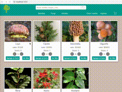

## Proyecto e-Comerce

## Dependencias adicionales 
** styled-components (https://www.npmjs.com/package/styled-components)

## Estructura de Archivos
# src

* [assets/](./src/assets)
  * [images/](./src/assets/images)
* [components/](./src/components)
  * [Icons/](./src/components/Icons)
    * [Heart.js](./src/components/Icons/Heart.js)
    * [Icon.js](./src/components/Icons/Icon.js)
    * [LeftArrow.js](./src/components/Icons/LeftArrow.js)
    * [PinUser.js](./src/components/Icons/PinUser.js)
    * [Search.js](./src/components/Icons/Search.js)
    * [ShopingCart.js](./src/components/Icons/ShopingCart.js)
    * [index.js](./src/components/Icons/index.js)
  * [Item/](./src/components/Item)
    * [index.js](./src/components/Item/index.js)
    * [styles.js](./src/components/Item/styles.js)
  * [ItemCount/](./src/components/ItemCount)
    * [index.js](./src/components/ItemCount/index.js)
    * [styles.js](./src/components/ItemCount/styles.js)
  * [ItemCountContainer/](./src/components/ItemCountContainer)
    * [index.js](./src/components/ItemCountContainer/index.js)
  * [ItemDetail/](./src/components/ItemDetail)
    * [index.js](./src/components/ItemDetail/index.js)
    * [styles.js](./src/components/ItemDetail/styles.js)
  * [ItemDetailContainer/](./src/components/ItemDetailContainer)
    * [index.js](./src/components/ItemDetailContainer/index.js)
  * [ItemList/](./src/components/ItemList)
    * [index.js](./src/components/ItemList/index.js)
    * [styles.js](./src/components/ItemList/styles.js)
  * [ItemListContainer/](./src/components/ItemListContainer)
    * [index.js](./src/components/ItemListContainer/index.js)
    * [styles.js](./src/components/ItemListContainer/styles.js)
  * [Loader/](./src/components/Loader)
    * [index.js](./src/components/Loader/index.js)
    * [styles.css](./src/components/Loader/styles.css)
  * [Navbar/](./src/components/Navbar)
    * [index.js](./src/components/Navbar/index.js)
    * [styles.js](./src/components/Navbar/styles.js)
* [constants/](./src/constants)
  * [items.js](./src/constants/items.js)
* [theme/](./src/theme)
  * [globalStyle.js](./src/theme/globalStyle.js)
* [App.js](./src/App.js)
* [index.js](./src/index.js)
